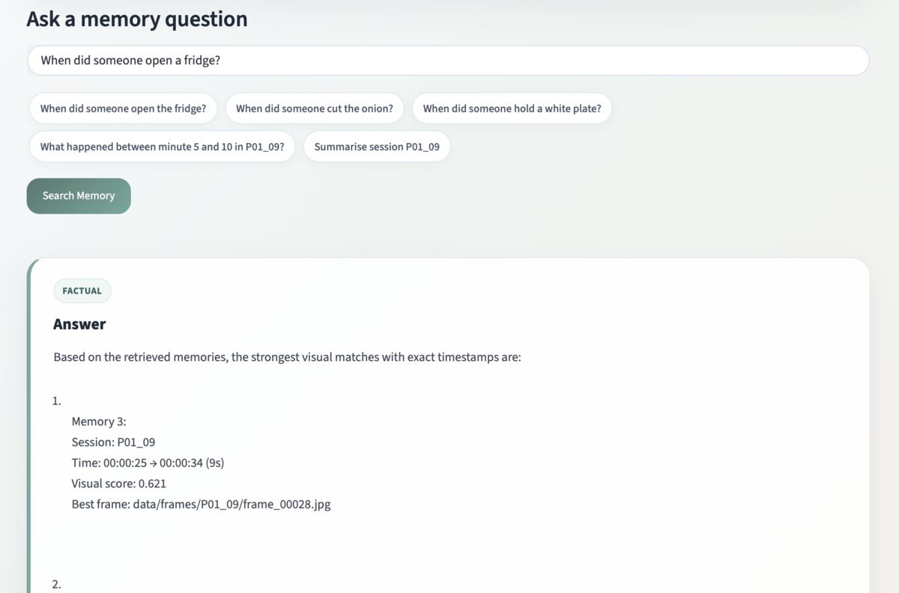
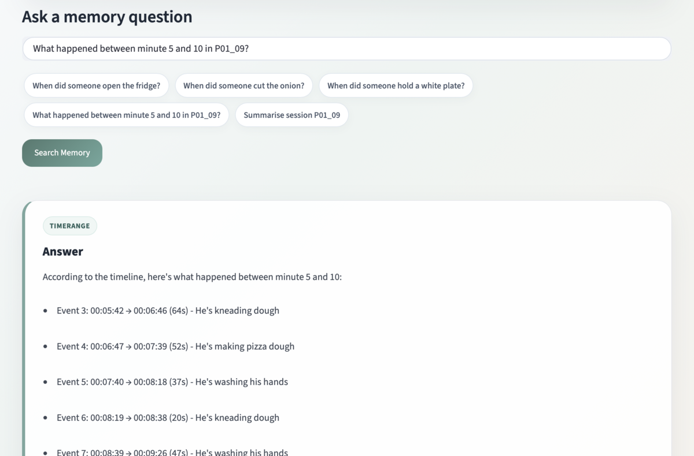
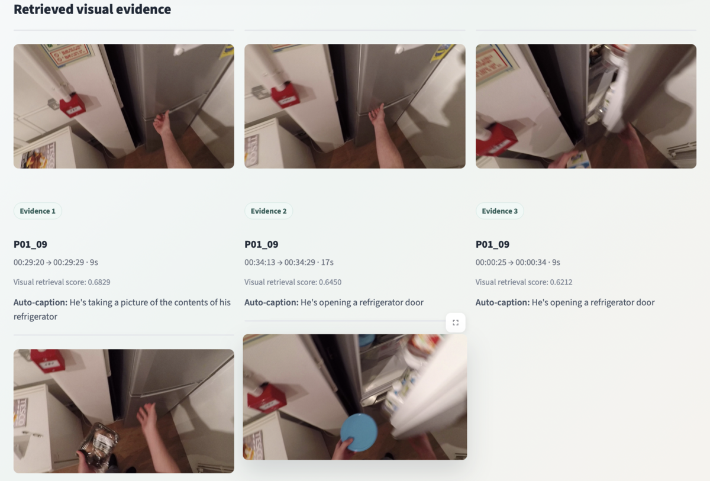
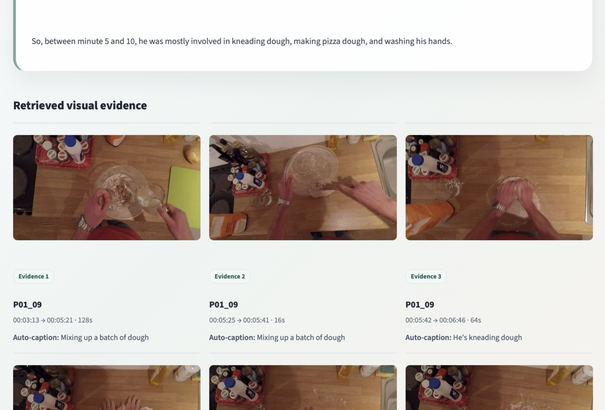

# 🧠 Lifelog Memory System
### A Multimodal AI Memory Retrieval System for Egocentric Video Understanding

<p align="center">
  
</p>

A research-oriented **personal memory retrieval system** that enables users to search and reason over long egocentric video memories using natural language queries.

The system combines **LaViLa video-language representations, FAISS vector search, event-level memory organization, temporal reasoning, and Llama (via Ollama)** to answer questions over long egocentric videos.

Example questions:

- *When did someone open the fridge?*
- *What happened before cutting vegetables?*
- *Summarise session P01_09*
- *How many times were hands washed?*

Instead of manually searching through hours of video, the system transforms visual experiences into a searchable semantic memory.

---

# ✨ Features

- 🔍 Natural language memory search
- 🎥 LaViLa-based visual-language retrieval
- 🧠 Frame-first event reconstruction
- ⏱️ Temporal reasoning over events
- 💬 Llama-powered memory assistant
- 🌐 Interactive Streamlit interface

---

# 🏗️ System Pipeline

```text
               User Query
                    │
                    ▼
          LaViLa Text Encoder
                    │
                    ▼
      Semantic Frame Retrieval (FAISS)
                    │
                    ▼
      Frame → Event Reconstruction
                    │
                    ▼
      Temporal Memory Reasoning
                    │
                    ▼
        Llama (via Ollama)
                    │
                    ▼
          Final Memory Answer
```

Unlike event-level retrieval systems, this project retrieves **individual frames first**, then reconstructs events around the strongest visual matches. This preserves visual evidence while allowing higher-level reasoning over activities.

---

# 🔍 Example Retrieval

<p align="center">
  
</p>

The retrieval system ranks candidate events according to the highest-scoring matching frame rather than relying only on event captions.

Each retrieved memory includes:

- Similarity score
- Best matching frame
- Event timestamps
- Session identifier
- Supporting BLIP-2 caption

---

# ⏱️ Temporal Reasoning

After locating an anchor event, the system reconstructs surrounding events to answer temporal questions.

Example:

```text
What happened before opening the fridge?
```

The system performs the following steps:

```text
Locate anchor event
        │
        ▼
Find surrounding events
        │
        ▼
Build chronological timeline
        │
        ▼
Generate natural language answer
```

<p align="center">
  
</p>

---

# 💬 LLM Memory Assistant

Retrieved events are passed to **Llama running through Ollama**.

The language model is instructed to:

- answer only using retrieved evidence
- preserve timestamps
- explain temporal relationships
- avoid hallucinating unseen events

Auto-generated captions are treated as supporting context rather than primary evidence.

---

# 🌐 Streamlit Web Interface

The project also includes an interactive Streamlit application for exploring memories.

<p align="center">
  
</p>

Features include:

- Natural language search
- Event visualization
- Matching frames
- Similarity scores
- Video playback
- Timestamp navigation

---

# 📈 Timeline Visualization

Temporal queries generate chronological event timelines before producing the final answer.

<p align="center">
  
</p>

---

# 📂 Project Structure

```text
Memory_Project/
│
├── data/
│   ├── frame_embeddings.npy
│   ├── frame_paths.txt
│   ├── frame_mean.npy
│   ├── events.json
│   └── session_timestamps.json
│
├── scripts/
│   ├── build_embeddings.py
│   ├── memory_qa.py
│   └── app.py
│
├── pretrained/
│   └── lavila_tsf_base_ep5.pth
│
├── LaViLa/
├── epic_data/
├── screenshots/
├── requirements.txt
└── README.md
```

---

# ⚙️ Installation

### Clone the repository

```bash
git clone https://github.com/sanskritijain1/lifelog-memory-qa.git
cd lifelog-memory-qa
```

### Create a conda environment

```bash
conda create -n lifelog2 python=3.10
conda activate lifelog2
```

### Install dependencies

```bash
pip install -r requirements.txt
```

---

# ▶️ Running the Project

## Command-Line Memory QA

```bash
python scripts/memory_qa.py
```

Example queries:

```text
When did someone open the fridge?

What happened before opening the fridge?

When did someone hold a white plate?

Summarise session P01_09

What happened between minute 5 and 10 in P01_09?

How many times were hands washed?
```

---

## Streamlit Web Application

Launch the web interface:

```bash
streamlit run scripts/app.py
```

Open your browser at:

```text
http://localhost:8501
```

---

# 📊 Dataset

This project is built on a processed subset of the **EPIC-KITCHENS** egocentric video dataset.

Current dataset statistics:

| Statistic | Value |
|-----------|------:|
| Sessions | 5 |
| Events | 420 |
| Indexed Frames | 13,825 |

---

# 🧪 Example Queries

### Object / Action Retrieval

```text
When did someone open the fridge?

When did someone cut the onion?

When did someone hold a white plate?
```

### Temporal Reasoning

```text
What happened before opening the fridge?

What happened after washing hands?

What happened around cutting vegetables?
```

### Timeline Queries

```text
What happened between minute 5 and 10 in P01_09?
```

### Session Summary

```text
Summarise session P01_09
```

### Counting

```text
How many times were hands washed?
```

---

# 🛠️ Technologies Used

| Component | Technology |
|-----------|------------|
| Video-Language Model | LaViLa |
| Text Encoder | LaViLa CLIP |
| Vector Database | FAISS |
| Deep Learning | PyTorch |
| Tokenizer | Hugging Face Transformers |
| Language Model | Llama (Ollama) |
| Web Interface | Streamlit |
| Dataset | EPIC-KITCHENS |

---

# 🚀 Future Improvements

- LLM-based query expansion
- Hybrid visual + caption retrieval
- Cross-session memory reasoning
- Automatic event summarization
- Memory graph representation
- Multi-person activity understanding
- Learned event segmentation

---

# 📌 Motivation

Human memories are organized around events rather than isolated images.

This project explores how AI systems can transform continuous egocentric video into a searchable, explainable, and interactive memory system using modern vision-language models, vector databases, and large language models.

---

# 👤 Author

**Sanskriti Jain**

M.Sc. Intelligent Interactive Systems

Universität Bielefeld

