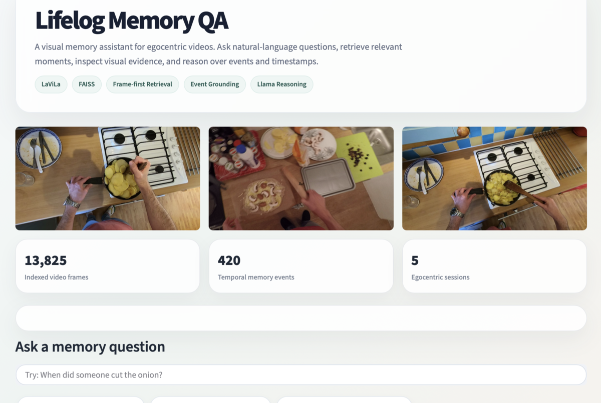

# 🧠 Lifelog Memory System  
### A Multimodal AI Memory Retrieval System for Egocentric Video Understanding

<p align="center">
  
</p>

A research-oriented **personal memory retrieval system** that enables users to search and reason over long egocentric video memories using natural language queries.

The system combines **video-language representation learning, vector retrieval, event-level memory organization, and large language models** to answer questions such as:

- "When did someone open the fridge?"
- "What happened before cutting vegetables?"
- "Summarize session P01_09"
- "How many times were hands washed?"

Instead of searching raw videos manually, the system converts visual experiences into a searchable semantic memory.

---

# ✨ Features

## 🔍 Semantic Memory Search

Search daily-life videos using natural language.

Examples:

```
open the fridge

person holding a knife

washing hands

cut vegetables
```

The system retrieves the most relevant moments from recorded experiences.

---

## 🎥 Video-Language Understanding with LaViLa

The system uses **LaViLa (Learning Video-Language Models)** to understand the relationship between:

- visual information
- temporal video context
- natural language queries

The model generates embeddings for video frames, enabling semantic similarity search.

Pipeline:

```
Video Frames
      |
      v
LaViLa Vision Encoder
      |
      v
Frame Embeddings
      |
      v
FAISS Vector Database
      |
      v
Natural Language Retrieval
```

---

# 🏗️ System Architecture

<p align="center">
  
</p>


The complete pipeline consists of:

```
                 User Query
                     |
                     v
            Query Understanding
                     |
                     v
              LaViLa Text Encoder
                     |
                     v
          Semantic Vector Retrieval
                     |
                     v
              FAISS Search Engine
                     |
                     v
          Frame-Level Similarity Search
                     |
                     v
              Event Reconstruction
                     |
                     v
        Temporal Memory Reasoning
                     |
                     v
              Llama Answer Generation
```

---

# 🚀 Core Components

## 1. Video Memory Representation

Raw videos are converted into frames.

Example:

```
data/
 └── frames/
      ├── P01_09/
      │     ├── frame_00000.jpg
      │     ├── frame_00001.jpg
      │     └── ...
      │
      └── P04_107/
```

Each frame is encoded into a semantic embedding using LaViLa.

Generated files:

```
data/frame_embeddings.npy
data/frame_paths.txt
```

---

# 2. Vector Memory Database

FAISS is used for efficient similarity search.

The system stores:

```
Frame embedding
        +
Frame location
        +
Session information
        +
Timestamp
```

allowing fast retrieval of relevant memories.

---

# 3. Frame-First Event Retrieval

Instead of directly searching events, the system follows a frame-first strategy:

```
Query

 ↓

Retrieve most similar frames

 ↓

Map frames to events

 ↓

Rank events using best matching frame

 ↓

Return memory moments
```

This improves retrieval accuracy because the original visual evidence remains the primary signal.

---

# 4. Temporal Memory Reasoning

The system supports time-aware questions.

Example:

Query:

```
What happened before opening the fridge?
```

Process:

```
Find "opening fridge" event

        ↓

Locate timestamp

        ↓

Retrieve previous events

        ↓

Build chronological timeline

        ↓

Generate answer
```

Example output:

```
Timeline:

00:02:30 Washing hands
00:02:55 Cutting vegetables
00:03:15 Opening fridge
```

---

# 5. LLM-Based Memory Assistant

The retrieved memories are passed to an LLM for reasoning.

Currently supported through:

- Ollama
- Llama models

The LLM is responsible for:

- summarizing retrieved memories
- explaining temporal relationships
- answering natural language questions

The model does not hallucinate new events and is constrained to retrieved evidence.

---

# 🖥️ Web Interface

The project includes an interactive Streamlit application.

<p align="center">
  
</p>


Features:

- Natural language search
- Retrieved event visualization
- Matching frames
- Video playback
- Similarity scores
- Timestamp navigation


Example:

Query:

```
When did someone open the fridge?
```

Output:

```
Session: P01_09

Time:
00:03:15 → 00:03:27

Confidence:
0.82

Matching frame:
[image]
```

---

# 📂 Project Structure

```
Memory_Project/

│
├── data/
│   ├── frame_embeddings.npy
│   ├── frame_paths.txt
│   ├── frame_mean.npy
│   ├── events.json
│   └── session_timestamps.json
│
├── scripts/
│   │
│   ├── build_embeddings.py
│   │      Generate LaViLa embeddings
│   │
│   ├── memory_qa.py
│   │      Command-line memory assistant
│   │
│   └── app.py
│          Streamlit interface
│
├── pretrained/
│   └── lavila_tsf_base_ep5.pth
│
├── LaViLa/
│
├── epic_data/
│
└── README.md
```

---

# ⚙️ Installation

## Create environment

```bash
conda create -n lifelog2 python=3.10

conda activate lifelog2
```

Install dependencies:

```bash
pip install -r requirements.txt
```

---

# ▶️ Running the System

## Command Line Memory QA

Run:

```bash
python scripts/memory_qa.py
```

Example:

```
Question > When did someone open the fridge?

Question > What happened before cutting vegetables?

Question > Summarise session P01_09
```

---

## Streamlit Interface

Run:

```bash
streamlit run scripts/app.py
```

Open:

```
http://localhost:8501
```

---

# 📊 Dataset

The project uses egocentric cooking videos from:

**EPIC-KITCHENS Dataset**

The processed dataset contains:

```
Sessions: 5

Events: 420

Frames indexed: 13,825
```

---

# 🧪 Example Queries

## Object / Action Retrieval

```
open the fridge
```

```
person holding knife
```

```
washing hands
```

---

## Temporal Questions

```
What happened before opening the fridge?
```

```
What happened after washing hands?
```

---

## Session Understanding

```
Summarise session P01_09
```

---

## Counting

```
How many times did someone wash hands?
```

---

# 🛠️ Technologies Used

| Component | Technology |
|-|-|
| Video Understanding | LaViLa |
| Vision-Language Model | CLIP-based Video Transformer |
| Vector Database | FAISS |
| Language Model | Llama via Ollama |
| Interface | Streamlit |
| Deep Learning | PyTorch |
| Dataset | EPIC-KITCHENS |

---

# 🔮 Future Improvements

Planned extensions:

- [ ] LLM-based automatic query expansion
- [ ] Hybrid text + visual retrieval
- [ ] Memory graph representation
- [ ] Person-aware memory grouping
- [ ] Long-term memory summarization
- [ ] Learned event segmentation
- [ ] Multi-session reasoning

---

# 📌 Project Motivation

Human memory is not stored as isolated images; it is organized around events, actions, and temporal relationships.

This project explores how AI systems can transform continuous visual experiences into searchable, explainable, and interactive memories.

---

# 👤 Author

**Sanskriti Jain**

M.Sc. Intelligent Interactive Systems  
Universität Bielefeld

